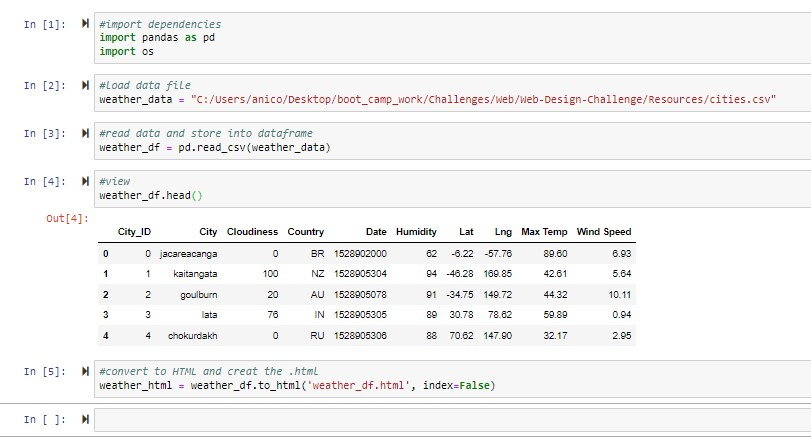

# Module 11 Challenge
## Web

# Background
Data becomes more powerful when you share it with others! That’s because people can use your data only if they can access it. So, you’ll use HTML and CSS to create a dashboard using weather data and  visualizations.

# Website Requirements
* Your website must consist of seven pages.

* At the top of every page, your website must have a navigation bar.

* Your website must be deployed to GitHub Pages.

# Landing Page
## Project Explanation
The purpose of this project was to analyze how weather changes as you get closer to the equator. To accomplish this analysis, we pulled data from the OpenWeatherMap API to assemble a dataset on over 500 cities.

After assembling the dataset, we used Matplotlib to plot various aspects of the weather vs. Latitude. Factors we examined included temperaturee, humidity, cloudiness, and wind speed. This site provides the source data, the visualizations created as part of the analysis, as well as explanations and descriptions of any trends and correlations witnessed.

* a link to each visualization page in a sidebar
    - preview images of the viz
    - the image will be a link to that page

# Vizualization Pages
## Max Temperature

## Humidity

## Cloudiness

## Wind Speed
    

# Data Page
* CSV data correctly loaded

* Use Bootstrap table class(es)
* Responsive based on page size
* all 10 columns in dataset

# Comparison Page
* all images loaded with correct labels and links
* responsive based on screen size

